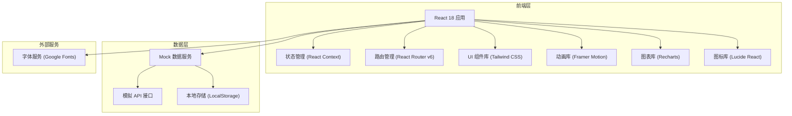
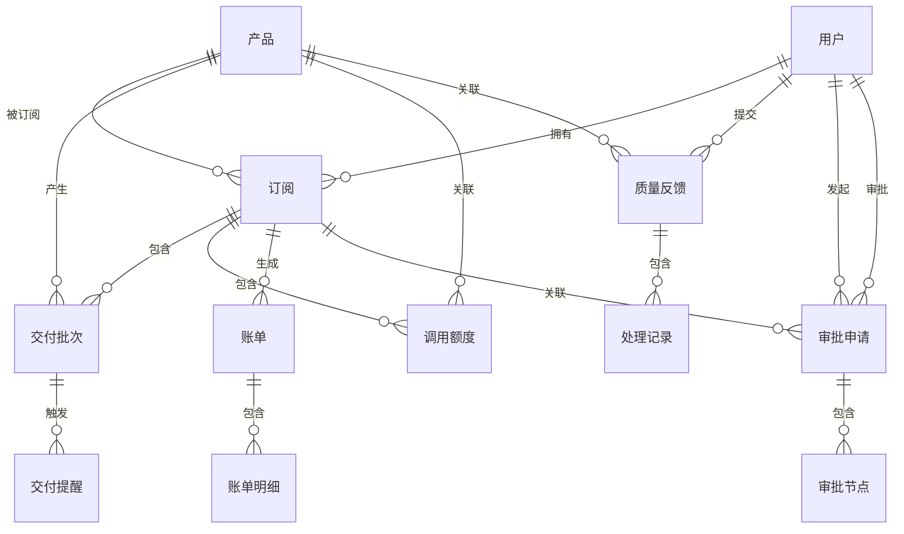

## 1. 架构设计



## 2. 技术描述

### 2.1 技术栈选型

- **前端框架**：React@18.2.0，使用 Hooks 进行状态管理
- **构建工具**：Vite@5.0.0，提供极速开发体验和优化构建
- **样式方案**：Tailwind CSS@3.4.0，原子化 CSS，自定义主题配置
- **路由管理**：React Router DOM@6.20.0，声明式路由
- **动画库**：Framer Motion@10.16.0，流畅的页面和元素动画
- **图表库**：Recharts@2.10.0，React 生态数据可视化
- **图标库**：Lucide React@0.294.0，统一风格的线性图标
- **语言**：TypeScript@5.3.0，类型安全

### 2.2 项目目录结构

```
src/
├── components/          # 公共组件
│   ├── Layout/         # 布局组件
│   │   ├── Sidebar.tsx
│   │   ├── Header.tsx
│   │   └── MainLayout.tsx
│   ├── ui/             # 基础 UI 组件
│   │   ├── Card.tsx
│   │   ├── Button.tsx
│   │   ├── Badge.tsx
│   │   ├── Modal.tsx
│   │   ├── Table.tsx
│   │   ├── Tabs.tsx
│   │   └── Progress.tsx
│   └── charts/         # 图表组件
│       ├── LineChart.tsx
│       ├── BarChart.tsx
│       ├── PieChart.tsx
│       └── RadarChart.tsx
├── pages/              # 页面组件
│   ├── Subscription/   # 产品订阅
│   ├── Delivery/       # 交付日历
│   ├── Quota/          # 调用额度
│   ├── Quality/        # 质量反馈
│   ├── Billing/        # 费用账单
│   ├── Members/        # 权限成员
│   └── Approval/       # 续订审批
├── data/               # Mock 数据
│   ├── mockData.ts
│   └── types.ts
├── hooks/              # 自定义 Hooks
│   ├── useModal.ts
│   └── useAnimation.ts
├── utils/              # 工具函数
│   ├── format.ts
│   └── date.ts
├── context/            # 状态管理
│   └── AppContext.tsx
├── App.tsx             # 根组件
├── main.tsx            # 入口文件
└── index.css           # 全局样式
```

### 2.3 前端工程化

- **代码规范**：ESLint + Prettier，统一代码风格
- **提交规范**：Husky + lint-staged，代码提交前校验
- **环境变量**：支持多环境配置
- **按需加载**：路由级代码分割，首屏加载优化

## 3. 路由定义

| 路由路径 | 页面名称 | 说明 |
|-----------|----------|------|
| / | 产品订阅 | 默认首页，展示订阅总览和产品列表 |
| /subscription | 产品订阅 | 管理已订阅产品和申请新产品 |
| /delivery | 交付日历 | 日历视图跟踪数据交付批次 |
| /quota | 调用额度 | 额度管理和使用情况分析 |
| /quality | 质量反馈 | 提交和跟踪数据质量问题 |
| /billing | 费用账单 | 账单管理和成本分析 |
| /members | 权限成员 | 成员管理和权限配置 |
| /approval | 续订审批 | 审批管理和流程跟踪 |

## 4. 数据模型

### 4.1 数据实体关系



### 4.2 核心数据模型

#### 产品 (Product)

```typescript
interface Product {
  id: string;
  name: string;
  provider: string;
  category: string;
  description: string;
  price: number;
  priceUnit: 'month' | 'year' | 'times';
  defaultQuota: number;
  dataType: string[];
  updateFrequency: string;
  coverage: string;
  sampleData: string[];
}
```

#### 订阅 (Subscription)

```typescript
interface Subscription {
  id: string;
  productId: string;
  productName: string;
  provider: string;
  status: 'active' | 'pending' | 'expired' | 'suspended';
  startDate: string;
  endDate: string;
  quota: number;
  usedQuota: number;
  receivers: Receiver[];
  autoRenewal: boolean;
  createdAt: string;
}

interface Receiver {
  id: string;
  name: string;
  email: string;
  phone: string;
  department: string;
}
```

#### 交付批次 (DeliveryBatch)

```typescript
interface DeliveryBatch {
  id: string;
  subscriptionId: string;
  productName: string;
  batchNo: string;
  deliveryDate: string;
  dataVolume: number;
  dataUnit: 'MB' | 'GB' | 'TB';
  recordCount: number;
  status: 'pending' | 'delivering' | 'completed' | 'failed';
  dataList: DataItem[];
  deliveryLog: DeliveryLog[];
}

interface DataItem {
  name: string;
  format: string;
  size: number;
  downloadUrl: string;
}

interface DeliveryLog {
  timestamp: string;
  status: string;
  operator: string;
  remark: string;
}
```

#### 调用额度 (Quota)

```typescript
interface Quota {
  id: string;
  subscriptionId: string;
  productName: string;
  totalQuota: number;
  usedQuota: number;
  unit: string;
  resetCycle: 'daily' | 'monthly' | 'yearly';
  lastResetDate: string;
  usageHistory: UsageRecord[];
  alertThreshold: number;
}

interface UsageRecord {
  date: string;
  usage: number;
}
```

#### 质量反馈 (QualityFeedback)

```typescript
interface QualityFeedback {
  id: string;
  subscriptionId: string;
  productName: string;
  type: 'accuracy' | 'integrity' | 'timeliness' | 'format' | 'other';
  severity: 'low' | 'medium' | 'high' | 'critical';
  title: string;
  description: string;
  attachments: string[];
  status: 'submitted' | 'processing' | 'resolved' | 'closed';
  submitter: string;
  submitTime: string;
  processingRecords: ProcessingRecord[];
  rating?: number;
  comment?: string;
}

interface ProcessingRecord {
  timestamp: string;
  operator: string;
  action: string;
  remark: string;
}
```

#### 账单 (Bill)

```typescript
interface Bill {
  id: string;
  period: string;
  totalAmount: number;
  status: 'unpaid' | 'paid' | 'overdue';
  issueDate: string;
  dueDate: string;
  paidDate?: string;
  items: BillItem[];
  departmentSummary: DepartmentCost[];
}

interface BillItem {
  id: string;
  productName: string;
  subscriptionId: string;
  quantity: number;
  unitPrice: number;
  amount: number;
  department: string;
}

interface DepartmentCost {
  department: string;
  amount: number;
  percentage: number;
}
```

#### 成员 (Member)

```typescript
interface Member {
  id: string;
  name: string;
  email: string;
  phone: string;
  avatar: string;
  role: 'super_admin' | 'admin' | 'user' | 'finance';
  department: string;
  permissions: Permission[];
  status: 'active' | 'inactive';
  joinDate: string;
}

interface Permission {
  module: string;
  actions: string[];
}
```

#### 审批申请 (ApprovalRequest)

```typescript
interface ApprovalRequest {
  id: string;
  type: 'renewal' | 'termination' | 'quota_expand' | 'new_subscription';
  title: string;
  subscriptionId: string;
  productName: string;
  applicant: string;
  applyTime: string;
  reason: string;
  status: 'pending' | 'approved' | 'rejected';
  currentNode: number;
  nodes: ApprovalNode[];
}

interface ApprovalNode {
  id: string;
  name: string;
  approver: string;
  status: 'pending' | 'approved' | 'rejected' | 'current';
  approveTime?: string;
  comment?: string;
}
```

## 5. 状态管理设计

使用 React Context + useReducer 实现全局状态管理：

```typescript
interface AppState {
  user: User;
  subscriptions: Subscription[];
  products: Product[];
  deliveries: DeliveryBatch[];
  quotas: Quota[];
  feedbacks: QualityFeedback[];
  bills: Bill[];
  members: Member[];
  approvals: ApprovalRequest[];
  notifications: Notification[];
}

type AppAction =
  | { type: 'LOAD_DATA'; payload: Partial<AppState> }
  | { type: 'ADD_SUBSCRIPTION'; payload: Subscription }
  | { type: 'UPDATE_SUBSCRIPTION'; payload: Subscription }
  | { type: 'ADD_FEEDBACK'; payload: QualityFeedback }
  | { type: 'UPDATE_FEEDBACK'; payload: QualityFeedback }
  | { type: 'ADD_APPROVAL'; payload: ApprovalRequest }
  | { type: 'UPDATE_APPROVAL'; payload: ApprovalRequest }
  | { type: 'ADD_NOTIFICATION'; payload: Notification }
  | { type: 'MARK_NOTIFICATION_READ'; payload: string };
```

## 6. 性能优化策略

1. **代码分割**：基于路由的动态导入，减少首屏加载体积
2. **组件懒加载**：使用 React.lazy() 按需加载非关键组件
3. **Memo 优化**：合理使用 React.memo、useMemo、useCallback 避免不必要重渲染
4. **虚拟列表**：长列表使用虚拟滚动优化渲染性能
5. **图表优化**：图表数据按需加载，使用防抖节流优化交互
6. **字体优化**：使用 font-display: swap 避免 FOIT，预加载关键字体
7. **图片优化**：使用 WebP 格式，懒加载非可视区域图片
8. **缓存策略**：合理使用浏览器缓存和内存缓存

## 7. 安全策略

1. **XSS 防护**：对用户输入进行转义处理，使用 React 自带的 XSS 防护
2. **CSRF 防护**：关键操作添加 token 验证
3. **敏感数据**：敏感信息加密存储，不在前端暴露
4. **权限控制**：前端路由级和组件级权限校验
5. **依赖安全**：定期更新依赖，修复已知安全漏洞
